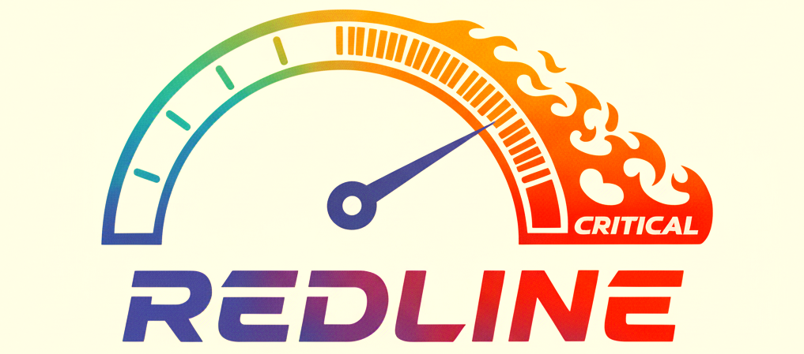

# REDLINE: A Solana Benchmarking Tool

Welcome to **REDLINE**, a benchmarking tool for Solana validators. We built REDLINE to help us understand how our own validators perform under heavy loads. We're sharing it in the hope that it might be useful for other developers and validator operators as well.

With REDLINE, you can simulate high-load scenarios, identify performance bottlenecks, and get a better sense of how your Solana infrastructure holds up. It offers flexible configuration options and a variety of benchmark modes to help you test your validator's performance.

-----

## Features

Here are some of the things you can do with REDLINE:

  * **Unified Benchmark Runner**: Run both TPS and RPS benchmarks, and even mix them together in the same run.
  * **Multi-threaded Execution**: Simulate real-world, high-load conditions by running multiple benchmark instances in parallel.
  * **Per-Request Statistics**: Get detailed stats on the performance of each benchmark mode.
  * **Flexible Benchmark Modes**: Test different aspects of your validator's performance with a variety of built-in benchmark modes.
  * **Customizable Configuration**: Use a simple TOML file to configure every aspect of the benchmark.
  * **Comprehensive Reporting**: Generate detailed, human-readable reports from your benchmark results.
  * **Minimal Resource Footprint**: REDLINE is designed to run locally alongside your validator without skewing the results.
  * **Accurate Measurements**: REDLINE is designed to provide accurate measurements of latencies and throughput.

-----

## Getting Started

Here’s how to get up and running with REDLINE:

### 1\. Clone the Repository

```bash
git clone https://github.com/magicblock-labs/redline.git
cd redline
```

### 2\. Build the Binaries

```bash
make build
```

This will build both the `redline` and `redline-assist` binaries in release mode.

### 3\. Prepare the Benchmark

Before running a benchmark, you'll need to create and fund the necessary accounts.

```bash
make prepare CONFIG=config.example.toml
```

This will get all the accounts ready for the benchmark.

### 4\. Run the Benchmark

Now you're ready to run the benchmark.

```bash
make bench CONFIG=config.example.toml
```

This will start the benchmark with the parameters specified in your configuration file.

-----

## Usage

REDLINE includes two binaries: `redline` for running the benchmark and `redline-assist` for some helpful utilities.

| Command | Description |
| --- | --- |
| `make build` | Builds the `redline` and `redline-assist` binaries. |
| `make prepare` | Prepares the environment for a benchmark run. |
| `make bench` | Runs the benchmark with the specified configuration. |
| `make report` | Generates a detailed report from the latest benchmark results. |
| `make bench-report` | Runs the benchmark and then generates a report. |
| `make compare` | Compares the results of the two most recent benchmark runs. |
| `make bench-compare`| Runs the benchmark and then compares the results with the previous run. |
| `make clean` | Deletes the latest benchmark result file. |
| `make clean-all` | Deletes all benchmark result files. |

-----

## Configuration

REDLINE uses a TOML file for configuration. Here's an overview of the available options:

```toml
# The number of parallel threads to run the benchmark on.
parallelism = 1

[connection]
# The URL of the main chain node.
chain-url = "http://api.devnet.solana.com"
# The URL of the ephemeral node.
ephem-url = "http://127.0.0.1:8899"
# The type of HTTP connection to use.
# Options: "http1" or { http2 = { streams = 128 } }
http-connection-type = { http2 = { streams = 128 } }
# The maximum number of HTTP connections.
http-connections-count = 16
# The maximum number of WebSocket connections.
ws-connections-count = 16

[benchmark]
# The total number of iterations.
iterations = 100000
# The target rate of requests or transactions per second.
rate = 3000
# The number of concurrent tasks.
concurrency = 64
# Whether to perform a preflight check for transactions.
preflight-check = false
# The number of accounts to use for the benchmark.
accounts-count = 8
# The benchmark mode to run.
mode = { mixed = [
    { mode = { high-cu-cost = { iters = 23 } }, weight = 50 },
    { mode = { simple-byte-set = {} }, weight = 29 },
    { mode = { read-write = {} }, weight = 20 },
    { mode = { commit = { accounts-per-transaction = 2 } }, weight = 1 },
] }

[confirmations]
# Whether to subscribe to account notifications.
subscribe-to-accounts = true
# Whether to subscribe to signature notifications.
subscribe-to-signatures = true
# Whether to use `getSignatureStatuses` for confirmations.
get-signature-status = false
# Whether to enforce total synchronization for confirmations.
enforce-total-sync = true

[data]
# The encoding for account data.
# Options: "base58", "base64", "base64+zstd"
account-encoding = "base64+zstd"
# The size of the accounts.
# Options: "bytes128", "bytes512", "bytes2048", "bytes8192"
account-size = "bytes128"
```

-----

## Conclusion

We hope REDLINE is a useful tool for you. If you have any questions or feedback, please feel free to open an issue or pull request on our GitHub repository.
